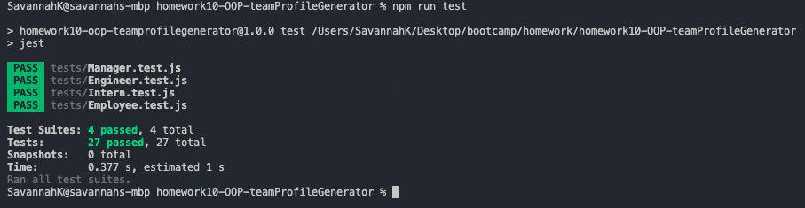

# Project Title : homework10-OOP-teamProfileGenerator


#### https://github.com/snk923/homework10-OOP-teamProfileGenerator

## Project Description:
A command-line application that takes in information about employees on a software engineering team, then generates an HTML webpage that displays summaries for each person. 

## Table of Contents
* [Installation](#installation)
* [Usage](#usage)
* [Contributors](#contributors)
* [Test](#test)
* [Questions](#questions)
* [License](#license)

## Installation
You will need to ensure that you have node.js installed on your device and complete an npm init within your terminal. This application will use [Jest](https://www.npmjs.com/package/jest) for running the unit tests and [Inquirer](https://www.npmjs.com/package/inquirer) for collecting input from the user. The application will be invoked by using the following command:

```terminal
node index.js
```

## Usage
You will need to fork and open this application and then open your terminal. Once you open your terminal, you will type ‘node index.js’. You will then answer the prompts to the best of your knowledge. Once all answers are completed, you will see ’Your Team Profile is ready!!’ And a team.html file will be found within the dist folder.

Walkthrough Video:

#### https://drive.google.com/file/d/1KzlFxj5anl8RgvlioDroJwSEI1tCewHe/view?usp=sharing

## Contributors
 If there is anything users feel would be beneficial to add, please continue to add. 

## Test
Ensure you have Jest in your node modules to run the tests found within the 'tests' folder



## Questions
If you have questions about this application please email: Savannahnkolb@gmail.com
Or visit my Github profile: https://github.com/snk923

## License
    MIT Copyright (c) 2021 Savannah Kolb

Permission is hereby granted, free of charge, to any person obtaining a copy
of this software and associated documentation files (the "Software"), to deal
in the Software without restriction, including without limitation the rights
to use, copy, modify, merge, publish, distribute, sublicense, and/or sell
copies of the Software, and to permit persons to whom the Software is
furnished to do so, subject to the following conditions:

The above copyright notice and this permission notice shall be included in all
copies or substantial portions of the Software.

THE SOFTWARE IS PROVIDED "AS IS", WITHOUT WARRANTY OF ANY KIND, EXPRESS OR
IMPLIED, INCLUDING BUT NOT LIMITED TO THE WARRANTIES OF MERCHANTABILITY,
FITNESS FOR A PARTICULAR PURPOSE AND NONINFRINGEMENT. IN NO EVENT SHALL THE
AUTHORS OR COPYRIGHT HOLDERS BE LIABLE FOR ANY CLAIM, DAMAGES OR OTHER
LIABILITY, WHETHER IN AN ACTION OF CONTRACT, TORT OR OTHERWISE, ARISING FROM,
OUT OF OR IN CONNECTION WITH THE SOFTWARE OR THE USE OR OTHER DEALINGS IN THE
SOFTWARE.
